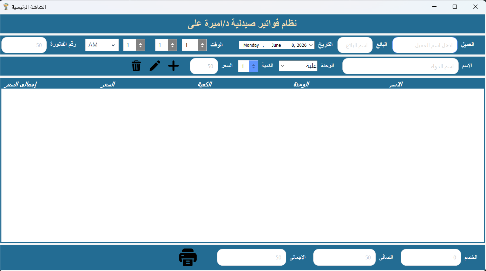
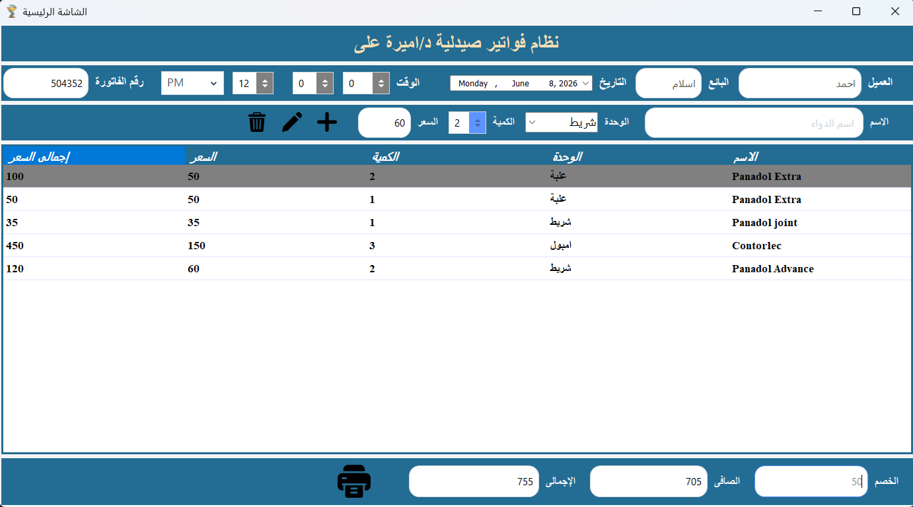
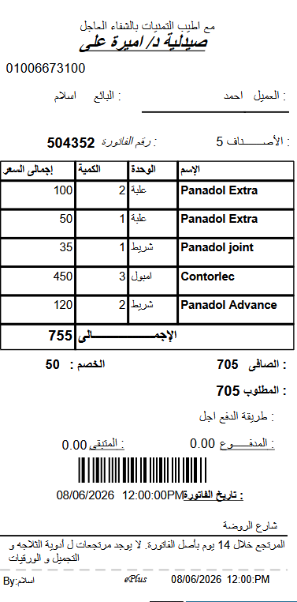

# Pharmacy Management & Receipt Printing System

A desktop application developed using C# WinForms and .NET Framework for pharmacy and retail receipt management.

## Features

* Product and invoice management
* Dynamic item entry and editing
* Automatic total calculation
* Receipt generation using RDLC Reports
* Thermal receipt printer support
* Dynamic CODABAR barcode generation
* Print preview using ReportViewer
* PDF export functionality
* Modern desktop UI

## Technologies Used

* C#
* WinForms
* .NET Framework
* RDLC Reports
* Microsoft ReportViewer
* ZXing.Net (Barcode Generation)
* Guna.UI2 WinForms Controls

## Receipt Features

* Professional receipt layout
* Dynamic invoice information
* Barcode generated automatically from invoice number
* Thermal printer friendly formatting
* PDF export support

## Screenshots

### Main Screen

### Invoice Entry

### Printed Receipt

## Project Highlights

This project was designed to simulate a real-world pharmacy and point-of-sale workflow, focusing on usability, reporting, barcode integration, and thermal receipt printing.

## Author

Ahmed Amir

Azure Administrator Associate
Cloud & Backend Enthusiast
